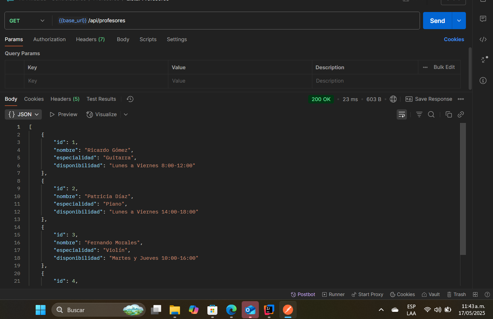
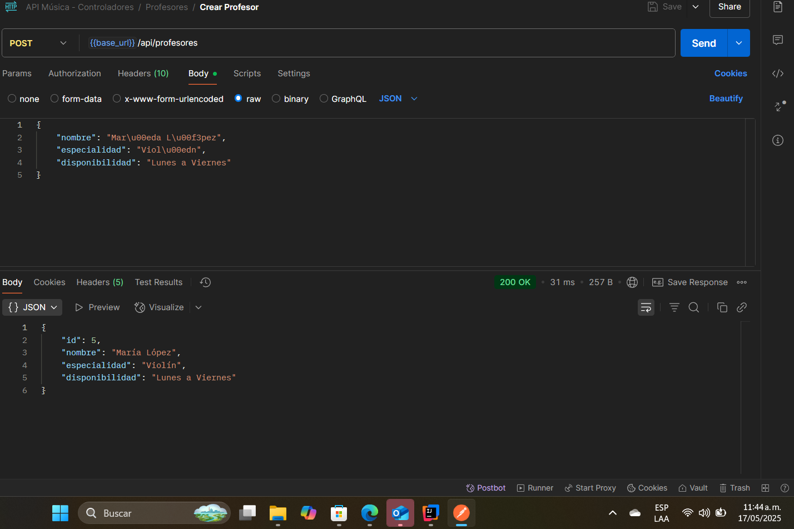
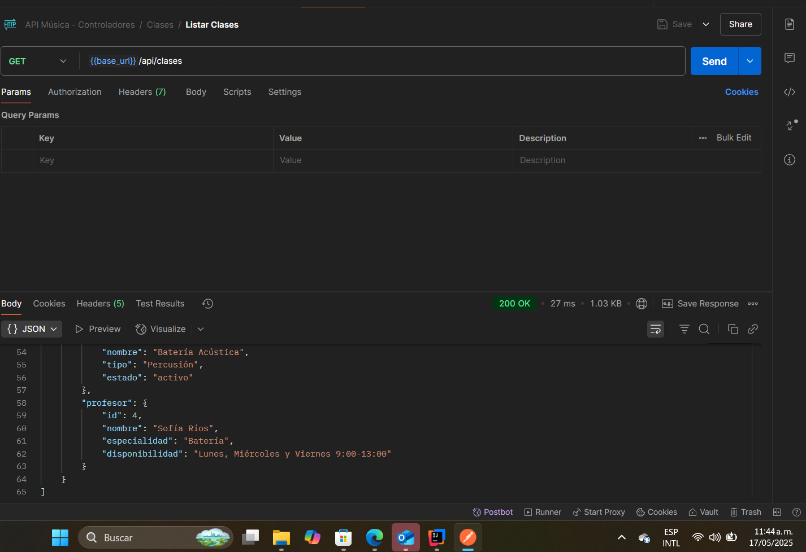
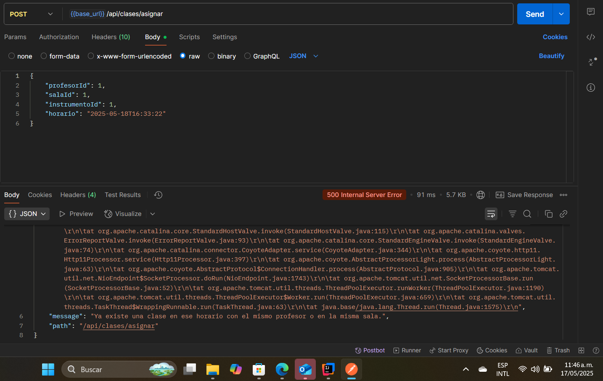
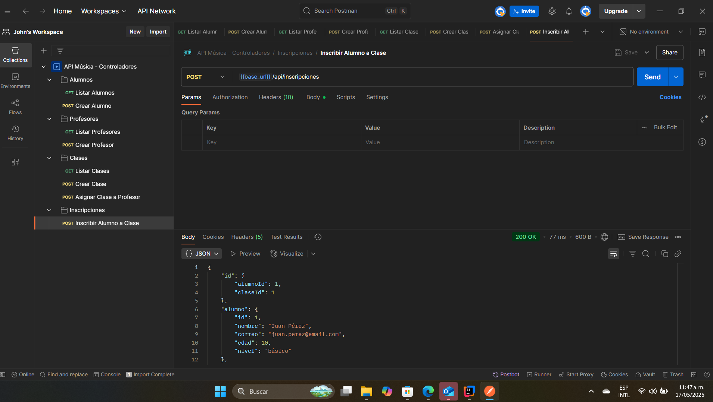

## 📄Proyecto MaestroMúsica 🎵


# 🎼 MaestroMúsica - Sistema de Gestión para Escuela de Música

**Autores:**  
- Juan Felipe Valencia Morales  
- Wesly Andrés Marín Pérez  

**Facultad de Ingenierías**  
**Tecnología en Sistematización de Datos**

---

## 📌 Descripción del Proyecto

**MaestroMúsica** es un sistema backend desarrollado con Java y Spring Boot que permite gestionar de forma eficiente la operación académica de una escuela de música.  
Incluye el registro y control de alumnos, profesores, instrumentos, clases y evaluaciones, aplicando reglas de negocio reales y buenas prácticas de diseño.

---

## 🎯 Objetivo

Desarrollar una API REST funcional que implemente reglas de negocio para controlar:

- Edad mínima de alumnos
- Límite de clases por alumno
- Límite de clases por profesor
- Estado de instrumentos
- Validación de horarios y disponibilidad

---

## 📊 Diagrama de Entidades y Relaciones

```text
[Alumno] 1---N [Inscripcion] N---1 [Clase]
[Profesor] 1---N [Clase]
[Clase] 1---1 [Instrumento]
[Clase] 1---1 [Sala]
[Evaluacion] N---1 [Alumno]
[Evaluacion] N---1 [Profesor]

Entidades:
- Alumno(id, nombre, correo, edad, nivel)
- Profesor(id, nombre, especialidad, disponibilidad)
- Clase(id, horario, sala_id, instrumento_id, profesor_id)
- Instrumento(id, nombre, tipo, estado)
- Sala(id, nombre, capacidad)
- Evaluacion(id, fecha, calificacion, observaciones, alumno_id, profesor_id)
- Inscripcion(id, alumno_id, clase_id)
````

---

## ⚙️ Instrucciones de Instalación

### 📦 Prerrequisitos

* Java 23 
* Maven
* IDE (IntelliJ o VSCode)

### ▶️ Pasos para ejecutar

1. Clonar el repositorio:

```bash
git clone https://github.com/Lifrars/entrega-proyecto-ms-springboot.githttps://github.com/Lifrars/entrega-proyecto-ms-springboot.git
```


3. Ejecutar con JetBrains 


4. Acceder a la consola H2 en el navegador:

```
http://localhost:8080/h2-console
JDBC URL: jdbc:h2:mem:vet_db
Usuario: sa
Contraseña: (vacía)
```

---

## 🔌 Endpoints y Ejemplos

### 🎓 Crear Alumno

**POST** `/api/alumnos`

**Request:**

```json
{
  "nombre": "Juan Felipe",
  "correo": "juan@mail.com",
  "edad": 10,
  "nivel": "intermedio"
}
```

**Response:**

```json
{
  "id": 1,
  "nombre": "Juan Felipe",
  "correo": "juan@mail.com",
  "edad": 10,
  "nivel": "intermedio"
}
```

---

### 🎶 Crear Clase

**POST** `/api/clases`

**Request:**

```json
{
  "profesorId": 1,
  "salaId": 2,
  "instrumentoId": 1,
  "horario": "2025-05-20T10:30:00"
}
```

---

### 👥 Listar Alumnos

**GET** `/api/alumnos`

---

## ✅ Reglas de Negocio Implementadas

| Código | Regla Operativa                                                             |
| ------ | --------------------------------------------------------------------------- |
| RN2    | No se permiten alumnos menores de 7 años                                    |
| RN3    | Un alumno puede estar inscrito en un máximo de 3 clases activas             |
| RN6    | Un profesor no puede tener más de 5 clases asignadas por semana             |
| RN9    | Las clases no pueden solaparse en horario ni para profesores ni para salas  |
| RN12   | No se puede asignar un instrumento que esté en mantenimiento o fuera de uso |

---

## 📖 Documentación Swagger / OpenAPI

Swagger UI está habilitado automáticamente con SpringDoc.

> 📍 Accede desde:
> [http://localhost:8080/swagger-ui.html](http://localhost:8080/swagger-ui.html)
> o
> [http://localhost:8080/swagger-ui/index.html](http://localhost:8080/swagger-ui/index.html)

Podrás probar todos los endpoints directamente desde esa interfaz.

---

## 🧪 Colección Postman / Insomnia

Hemos incluido una colección de Postman con todos los endpoints implementados, lista para importar.

📁 Ubicación:
`/documentacion/maestromusica-collection.json`

Cómo usar:

1. Abre Postman o Insomnia
2. Importa el archivo `.json`
3. Ejecuta los endpoints `GET`, `POST`, `PUT` y verifica las validaciones

---

## 🧠 Validaciones Avanzadas

El sistema maneja:

* Validaciones automáticas con anotaciones `@Min`, `@Email`, `@Pattern`, etc.
* Reglas de negocio personalizadas en la capa de servicio
* Excepciones controladas y mensajes legibles
* Validación de colisiones horarias entre clases

---

## 📎 Archivos incluidos

```
src/
├── java/com/poli/vet/
│   ├── controller/     # Controladores REST
│   ├── dto/            # Data Transfer Objects
│   ├── entity/         # Entidades JPA
│   ├── repository/     # Repositorios Spring Data
│   ├── service/        # Lógica de negocio
│   ├── exception/      # Manejo de errores (opcional)
│   └── config/         # Swagger/OpenAPI y demás configs
└── resources/
    ├── application.properties
    ├── schema.sql
    └── data.sql
```
---

## Resultados de Enpoints





